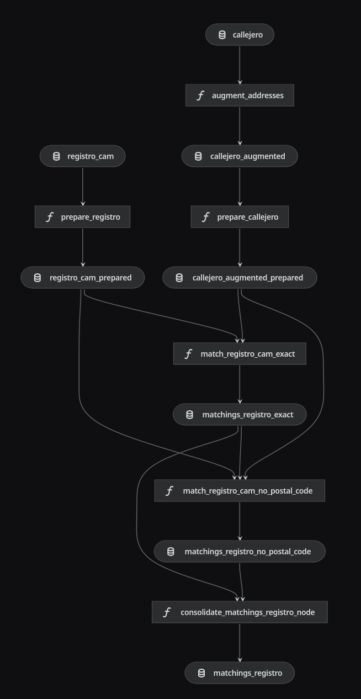
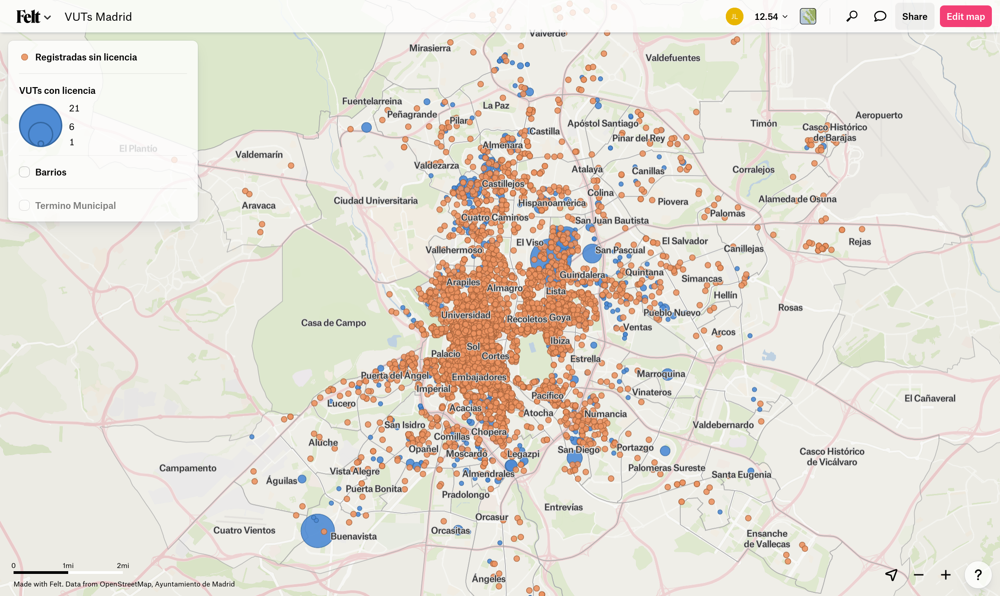
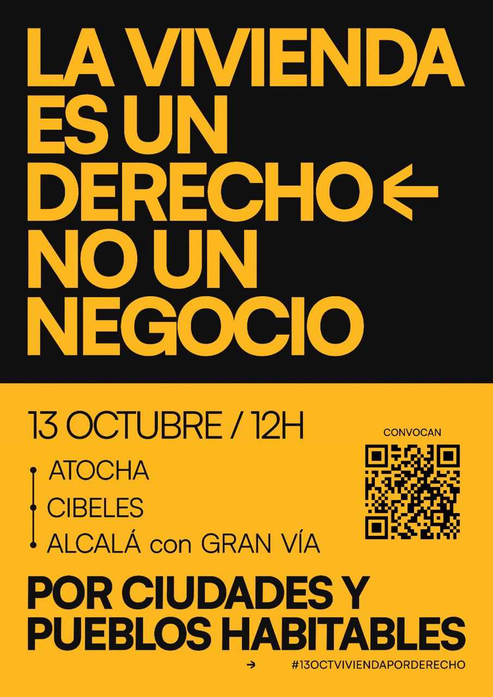

# desalkila

**La vivienda es un derecho, no un negocio**

## Resumen

> [!WARNING]
> Este proyecto está en pausa hasta aclarar los siguientes pasos.
> Eres libre de hacer con este código lo que consideres dentro de los términos de la licencia (ver `LICENSE`).
> Si tienes cualquier duda, por favor abre un issue.



En `catalog_source.yml` están listadas las fuentes de datos:

1. El **registro** de la Comunidad de Madrid (autonómico) ([condiciones](https://www.comunidad.madrid/gobierno/datos-abiertos/reutiliza-datos-abiertos-comunidad-madrid#condiciones-uso))
2. Las **licencias** urbanísticas para Viviendas de Uso Turístico del Ayuntamiento de Madrid (municipal) ([condiciones](https://datos.madrid.es/egob/catalogo/aviso-legal))
3. El **callejero** de Madrid (municipal) ([condiciones](https://datos.madrid.es/egob/catalogo/aviso-legal))
4. Los datos abiertos de **Airbnb** recopilados por el proyecto Inside Airbnb ([políticas](https://insideairbnb.com/data-policies/))

En atención a los diferentes términos de uso de estas fuentes,
no se republican los datos en crudo ni tampoco elaboraciones de los mismos.

## Uso

Los datos se procesan usando pipelines de [Kedro](https://github.com/kedro-org/kedro/).

El entorno `dev` está configurado para almacenar los datos en un [MinIO](https://github.com/minio/minio) local.
Para levantarlo, puedes utilizar el archivo `docker-compose.yaml` incluido en el repositorio:

```
$ docker compose up minio -d
```

Una vez esté corriendo MinIO, puedes ejecutar los pipelines. Por ejemplo, para ingestar el callejero:

```
$ uv run kedro run --to-outputs=callejero
...
[10/11/24 09:40:24] INFO     Kedro project desalkila
...
[10/11/24 09:41:10] INFO     Completed 5 out of 5 tasks
                    INFO     Pipeline execution completed successfully.
```

### Modo manual

También puedes crear un entorno virtual, activarlo, instalar las dependencias, y correr Kedro:

```
$ uv venv -p 3.11
$ source .venv/bin/activate
(.venv) $ uv pip install -r requirements.txt
(.venv) $ kedro run --to-outputs=callejero
...
```

## Mapa

Estos datos se pueden visualizar en http://desalkila.madrid



## Camiseta

Puedes adquirir la camiseta de "SE ANIQUILA" en [la tienda online de Sistema de Monos](https://sistemademonos.com/Tienda).


El diseño y la serigrafía son de [Hola Por Qué](https://holaporque.com/), una entidad de la Economía Solidaria
que forma parte del [Mercado Social de Madrid](https://www.mercadosocial.madrid/).

Si quieres saber más, mira [mi charla "Python para un mundo mejor: informe desde la trinchera" de la PyConES 2023](https://www.youtube.com/watch?v=teVqkugbBDI) ([diapositivas](https://speakerdeck.com/astrojuanlu/python-para-un-mundo-mejor-informe-desde-la-trinchera)).

## Manifestación 13 de octubre de 2024

> Madrid tomará las calles el próximo 13-O bajo el lema “Se acabó: bajemos los alquileres”,
> para mostrar el hartazgo de las vecinas de la capital y su apoyo masivo a una futura huelga de alquileres

[Convocantes](https://docs.google.com/document/u/1/d/1FDTrwcZhS-cZ2Im7FZO68s31Gl_T7CPCLfFrgSQXQKU/mobilebasic)



(también accesible en https://propietariossolidarios.org/)

## Próximos pasos

- Documentar el código actual más allá de este escueto README
- Crear las tablas ["gold"](https://www.databricks.com/glossary/medallion-architecture) con agregaciones que faciliten el trabajo analítico
- Crear un notebook que explique cómo trabajar con estos datos
- Tratar de replicar este esquema para otras ciudades españolas
- Incorporar el catastro, el CONEX y otras fuentes para ubicar todos los Airbnb que se puedan
- ?
